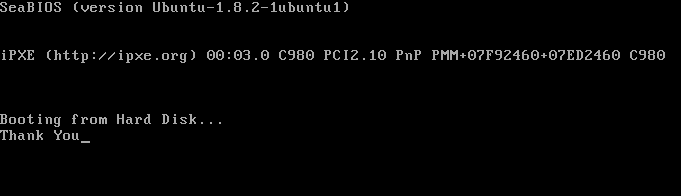

TYVM - Thank You Virtual Machine
================================

What is it?
-----------

This is a VM (technically, a bootloader, but that's literally the simplest you can go), 
that prints "Thank You" and does nothing.

Why is it?
----------

Because people keep quoting `tyvm` in chats, and it drives me crazy, because I
always mentally picture this. 

A virtual machine that prints "Thank You".

Usage
-----

	$ qemu-system-x86_64 -drive format=raw,file=tyvm.bin

Also works for 32-bit.

	$ qemu-system-i386 -drive format=raw,file=tyvm.bin

Sample
------

	$ qemu-system-x86_64 -drive format=raw,file=tyvm.bin

